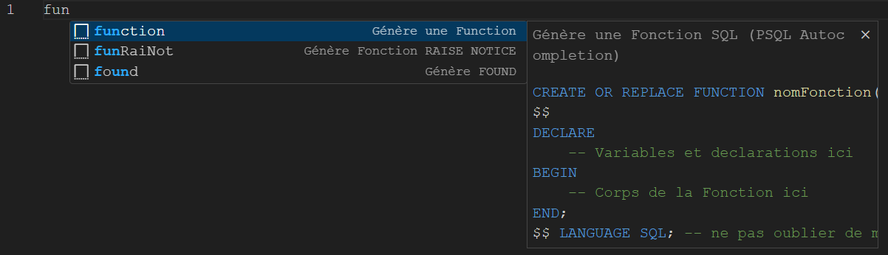

# PSQL Autocompletion

## Description

PSQL Autocompletion est une extension pour Visual Studio Code qui facilite l'écriture de requêtes SQL en générant automatiquement des snippets SQL pour les fonctions courantes et les tâches de développement SQL.

## Fonctionnalités

L'extension PSQL Autocompletion offre les fonctionnalités suivantes :

### Générer une Fonction SQL

Ce snippet génère un squelette pour créer une fonction SQL.

- Utilisation du préfixe : `function`

### Générer une Entête

Ce snippet génère un en-tête de commentaire pour vos fichiers SQL.

- Utilisation du préfixe : `entete`

### Générer des Infos sur une Fonction

Ce snippet génère des informations sur l'utilisation d'une fonction SQL.

- Utilisation du préfixe : `info_fonction`

### Générer des Infos sur PSQL

Ce snippet génère des informations utiles pour travailler avec PostgreSQL.

- Utilisation du préfixe : `info_psql`

### Générer un SELECT Complet

Ce snippet génère une requête SELECT SQL complète avec clauses FROM, WHERE, GROUP BY et HAVING.

- Utilisation du préfixe : `selcom`

...et bien [plus encore](./data/info/info.md) !

## Installation

Pour installer l'extension PSQL Autocompletion, suivez ces étapes :

1. Ouvrez Visual Studio Code.
2. Accédez à la vue des extensions.
3. Recherchez "PSQL Autocomplétions".
4. Cliquez sur "Installer" pour installer l'extension.

## Utilisation

Une fois l'extension installée, vous pouvez utiliser les snippets en tapant les préfixes mentionnés ci-dessus dans un fichier SQL et en appuyant sur la touche Tab.

<!--  -->

## Contributions

Les contributions sont les bienvenues ! Si vous souhaitez contribuer à l'amélioration de cette extension, n'hésitez pas à créer une demande de pull sur GitHub.

## Licence

Ce projet est sous licence MIT. Voir le fichier [LICENSE](LICENSE.md) pour plus de détails.

---

Développé par [Dunet Tom](https://github.com/Oridoshi)
